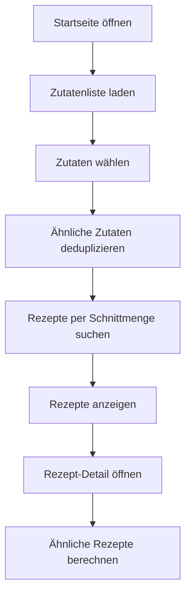

<!-- TOC -->

    - [1. Features](#1-features)
    - [2. Ablauf (Kurzfassung)](#2-ablauf-kurzfassung)
    - [3. Ablaufdiagramm (Mermaid)](#3-ablaufdiagramm-mermaid)
    - [4. NLP/Ähnlichkeitslogik (Probleme & Lösungen)](#4-nlpähnlichkeitslogik-probleme--lösungen)
    - [5. Setup (kurz)](#5-setup-kurz)
        - [5.1. Zusätzliche Requirements für Cache-Generierung](#51-zusätzliche-requirements-für-cache-generierung)
- [1. Features](#1-features)
- [2. Ablauf (Kurzfassung)](#2-ablauf-kurzfassung)
- [3. Ablaufdiagramm (Mermaid)](#3-ablaufdiagramm-mermaid)
- [4. NLP/Ähnlichkeitslogik (Probleme \& Lösungen)](#4-nlpähnlichkeitslogik-probleme--lösungen)
- [5. Setup (kurz)](#5-setup-kurz)
  - [5.1. Zusätzliche Requirements für Cache-Generierung](#51-zusätzliche-requirements-für-cache-generierung)
- [6. Ausführen (Bash)](#6-ausführen-bash)
- [7. Projektstruktur](#7-projektstruktur)
- [8. API-Endpoints (Backend)](#8-api-endpoints-backend)
- [9. TheMealDB-API-Integration](#9-themealdb-api-integration)
- [10. Beiträge](#10-beiträge)
- [11. KI-Einsatz](#11-ki-einsatz)

<!-- /TOC -->
<!-- # 1. Rezept-Empfehlungssystem -->

Ein webbasiertes Rezeptempfehlungssystem mit Zutatenwahl über eine benutzerfreundliche Oberfläche.

## 1. Features

✅ **Zutatenwahl-Interface**
- Alle Zutaten von TheMealDB laden
- Kachel-Layout mit Zutatenbildern
- Suchfeld mit Auto-Completion
- Gewählte Zutaten als Tags anzeigen

✅ **Rezept-Suche**
- Rezepte nach gewählten Zutaten suchen
- Rezeptkarten mit Bildern anzeigen
- Detailansicht mit Zutaten + Anleitung

✅ **TheMealDB-Integration**
- Kostenlose API ohne Authentifizierung
- Caching zur Rate-Limit-Vermeidung
- RESTful API-Wrapper

✅ **Ähnlichkeits-Logik für Zutaten (NLP-light)**
- Zusammenführen ähnlicher Zutaten (z. B. „Beef“ vs. „Beef Fillet“)
- Vermeidet zu restriktive Schnittmengen

## 2. Ablauf (Kurzfassung)

1. **Start**: App lädt Zutatenliste aus TheMealDB.
2. **Zutatenwahl**: Nutzer wählt Zutaten über UI oder Suche.
3. **Dedup**: Ähnliche Zutaten werden zusammengeführt.
4. **Rezeptsuche**: Rezepte werden per Schnittmenge ermittelt.
5. **Detailansicht**: Zutaten + Anleitung; ähnliche Rezepte werden empfohlen.

## 3. Ablaufdiagramm (Mermaid)



## 4. NLP/Ähnlichkeitslogik (Probleme & Lösungen)

**Probleme:**
- Unterschiedliche Schreibweisen (z. B. "Basil", "Basil Leaves")
- Synonyme/Varianten verhindern Treffer in der Schnittmenge
- API liefert teils ähnliche Zutaten als separate Einträge

**Lösungen im Projekt:**
- Ähnlichkeits-Cache für Zutaten (vorberechnet)
- Dedup-Logik, die ähnliche Zutaten in der Auswahl zusammenführt
- Normalisierung von Strings (klein + Akzente entfernen)

**Notebook:**
- Der Ähnlichkeitsindex wird im Notebook erstellt: [rezept-empfehlungssystem/createIndexForSimilarIngredients.ipynb](rezept-empfehlungssystem/createIndexForSimilarIngredients.ipynb)


## 5. Setup (kurz)

```bash
python3.9 -m venv .venvRezept
source .venvRezept/Scripts/activate
pip install -r requirements.txt
```

**Hinweis zu Abhängigkeiten:**

- Für den normalen Produktivbetrieb (Web-App, Rezepte suchen, Zutatenwahl etc.) reicht die Installation von `requirements.txt`.
- **Für die Erstellung oder Aktualisierung des Zutaten-Ähnlichkeits-Cache (JSON) via Notebook `createIndexForSimilarIngredients.ipynb` gibt es eine separate requirements-Datei:**
  - `requirements-nlp-cache.txt` (enthält alle nötigen NLP-Bibliotheken)

Diese Pakete sind **nicht** in der Standard-`requirements.txt` enthalten, da sie nur für die einmalige Generierung des Caches gebraucht werden.

### 5.1. Zusätzliche Requirements für Cache-Generierung

Falls der Zutaten-Ähnlichkeits-Cache (`ingredient_similarity_cache_*.json`) neu erstellt werden soll:

```bash
# (Im aktivierten venv)
pip install -r requirements-nlp-cache.txt
```

Danach kann das Notebook `createIndexForSimilarIngredients.ipynb` ausgeführt werden, um die JSON-Datei zu erzeugen.

Hinweis: Die spaCy-Modelle (`en_core_web_md`, `en_core_web_trf`) sind in `requirements-nlp-cache.txt` als direkte Wheels enthalten. Falls die Installation der Modelle fehlschlägt, kann man sie manuell nachinstallieren:

```bash
python -m spacy download en_core_web_md
python -m spacy download en_core_web_trf
```

Wenn nach der Installation die Meldung erscheint „You can now load the package via spacy.load('en_core_web_md')“, ist das **korrekt** – das Modell ist erfolgreich installiert und kann direkt in `spacy.load(...)` verwendet werden.

**Im Produktivbetrieb werden diese Pakete nicht benötigt!**

## 6. Ausführen (Bash)

```bash
cd rezept-empfehlungssystem
python app.py
```
Die Anwendung läuft unter: `http://localhost:5000`


## 7. Projektstruktur

```
rezept-empfehlungssystem/
├── app.py                              # Flask-Anwendung
├── themealdb_client.py                 # TheMealDB-API-Wrapper
├── createIndexForSimilarIngredients.ipynb
├── ingredient_similarity_cache_*.json  # Ähnlichkeits-Cache
├── templates/
│   ├── index.html
│   ├── recipes.html
│   └── recipe_detail.html
└── static/
    ├── ingredients-search.js
    └── style.css
```

## 8. API-Endpoints (Backend)

| Endpoint | Methode | Beschreibung |
|----------|---------|-------------|
| `/` | GET | Startseite (Zutatenwahl) |
| `/recipes` | GET | Rezepte-Ergebnisseite |
| `/recipe/<meal_id>` | GET | Detailseite für ein Rezept |

## 9. TheMealDB-API-Integration

- **Quelle**: https://www.themealdb.com/api.php
- **Endpoints genutzt**:
  - `GET /list.php?i=list` – alle Zutaten
  - `GET /filter.php?i={ingredient}` – Rezepte nach Zutat
  - `GET /lookup.php?i={meal_id}` – Rezept-Details
- **Zutatenbilder**: `https://www.themealdb.com/images/ingredients/{name}.png`

## 10. Beiträge

**Grundgerüst:**
- Gemeinsam mit KI-Unterstützung erstellt

**Maximilian Grote:**
- Zutaten-Normalisierung mit NLP
- Erweiterung `TheMealDBClient` (z. B. `search_recipes_by_ingredient`)
- Ähnlichkeits-Cache-Integration

**Julien Maximilian Wache:**
- Rezept-Detail-Funktion (`get_recipe_details`)
  - Rezept-Anzeige (Frontend + Backend)(`score_ingredient`)
- Empfehlungslogik basierend auf ausgewähltem Rezept (TF-IDF) (`recommend_similar_recipes`)


## 11. KI-Einsatz

Für Teile der Ideenfindung, Code-Überarbeitung und Dokumentation wurde KI-Unterstützung verwendet (z. B. Textentwürfe, Strukturvorschläge, Refactoring-Ideen, README-Erstellung).
