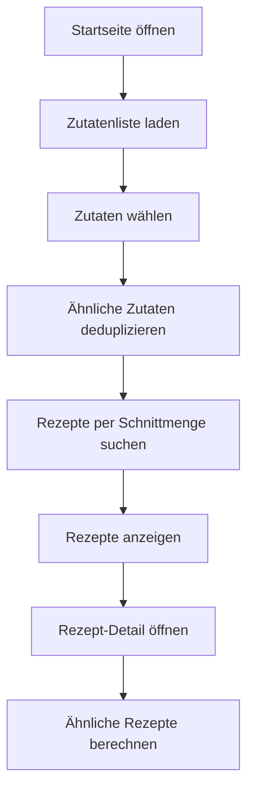

# Rezept-Empfehlungssystem<!-- TOC -->

- [Rezept-Empfehlungssystem](#rezept-empfehlungssystem)
  - [Features](#features)
  - [Ablauf (Kurzfassung)](#ablauf-kurzfassung)
  - [Ablaufdiagramm (Mermaid)](#ablaufdiagramm-mermaid)
  - [NLP/Ähnlichkeitslogik (Probleme \& Lösungen)](#nlpähnlichkeitslogik-probleme--lösungen)
  - [Setup (kurz)](#setup-kurz)
  - [Ausführen (Bash)](#ausführen-bash)
  - [Projektstruktur](#projektstruktur)
  - [API-Endpoints (Backend)](#api-endpoints-backend)
  - [TheMealDB-API-Integration](#themealdb-api-integration)
  - [Beiträge](#beiträge)
  - [KI-Einsatz](#ki-einsatz)

<!-- /TOC -->

Ein webbasiertes Rezeptempfehlungssystem mit Zutatenwahl über eine benutzerfreundliche Oberfläche.

## Features

✅ **Zutatenwahl-Interface**
- Alle Zutaten von TheMealDB laden
- Kachel-Layout mit Zutatenbildern
- Suchfeld mit Auto-Completion
- Gewählte Zutaten als Tags anzeigen

✅ **Rezept-Suche**
- Rezepte nach gewählten Zutaten suchen
- Rezeptkarten mit Bildern anzeigen
- Detailansicht mit Zutaten + Anleitung

✅ **TheMealDB-Integration**
- Kostenlose API ohne Authentifizierung
- Caching zur Rate-Limit-Vermeidung
- RESTful API-Wrapper

✅ **Ähnlichkeits-Logik für Zutaten (NLP-light)**
- Zusammenführen ähnlicher Zutaten (z. B. „Beef“ vs. „Beef Fillet“)
- Vermeidet zu restriktive Schnittmengen

## Ablauf (Kurzfassung)

1. **Start**: App lädt Zutatenliste aus TheMealDB.
2. **Zutatenwahl**: Nutzer wählt Zutaten über UI oder Suche.
3. **Dedup**: Ähnliche Zutaten werden zusammengeführt.
4. **Rezeptsuche**: Rezepte werden per Schnittmenge ermittelt.
5. **Detailansicht**: Zutaten + Anleitung; ähnliche Rezepte werden empfohlen.

## Ablaufdiagramm (Mermaid)



## NLP/Ähnlichkeitslogik (Probleme & Lösungen)

**Probleme:**
- Unterschiedliche Schreibweisen (z. B. „Beef“, „Beef Fillet“)
- Synonyme/Varianten verhindern Treffer in der Schnittmenge
- API liefert teils ähnliche Zutaten als separate Einträge

**Lösungen im Projekt:**
- Ähnlichkeits-Cache für Zutaten (vorberechnet)
- Dedup-Logik, die ähnliche Zutaten in der Auswahl zusammenführt
- Normalisierung von Strings (klein + Akzente entfernen)

**Notebook:**
- Der Ähnlichkeitsindex wird im Notebook erstellt: [rezept-empfehlungssystem/createIndexForSimilarIngredients.ipynb](rezept-empfehlungssystem/createIndexForSimilarIngredients.ipynb)


## Setup (kurz)

```bash
python3.9 -m venv .venvRezept
source .venvRezept/Scripts/activate
pip install -r requirements.txt
```

## Ausführen (Bash)

```bash
cd rezept-empfehlungssystem
python app.py
```
Die Anwendung läuft unter: `http://localhost:5000`


## Projektstruktur

```
rezept-empfehlungssystem/
├── app.py                              # Flask-Anwendung
├── themealdb_client.py                 # TheMealDB-API-Wrapper
├── createIndexForSimilarIngredients.ipynb
├── ingredient_similarity_cache_*.json  # Ähnlichkeits-Cache
├── templates/
│   ├── index.html
│   ├── recipes.html
│   └── recipe_detail.html
└── static/
    ├── ingredients-search.js
    └── style.css
```

## API-Endpoints (Backend)

| Endpoint | Methode | Beschreibung |
|----------|---------|-------------|
| `/` | GET | Startseite (Zutatenwahl) |
| `/recipes` | GET | Rezepte-Ergebnisseite |
| `/recipe/<meal_id>` | GET | Detailseite für ein Rezept |

## TheMealDB-API-Integration

- **Quelle**: https://www.themealdb.com/api.php
- **Endpoints genutzt**:
  - `GET /list.php?i=list` – alle Zutaten
  - `GET /filter.php?i={ingredient}` – Rezepte nach Zutat
  - `GET /lookup.php?i={meal_id}` – Rezept-Details
- **Zutatenbilder**: `https://www.themealdb.com/images/ingredients/{name}.png`

## Beiträge

**Grundgerüst:**
- Gemeinsam mit KI-Unterstützung erstellt

**Maximilian Grote:**
- Zutaten-Normalisierung mit NLP
- Erweiterung `TheMealDBClient` (z. B. `search_recipes_by_ingredient`)
- Ähnlichkeits-Cache-Integration

**Julien Maximilian Wache:**
- Rezept-Detail-Funktion (`get_recipe_details`)
  - Rezept-Anzeige (Frontend + Backend)(`score_ingredient`)
- Empfehlungslogik basierend auf ausgewähltem Rezept (TF-IDF) (`recommend_similar_recipes`)


## KI-Einsatz

Für Teile der Ideenfindung, Code-Überarbeitung und Dokumentation wurde KI-Unterstützung verwendet (z. B. Textentwürfe, Strukturvorschläge, Refactoring-Ideen, README-Erstellung).
